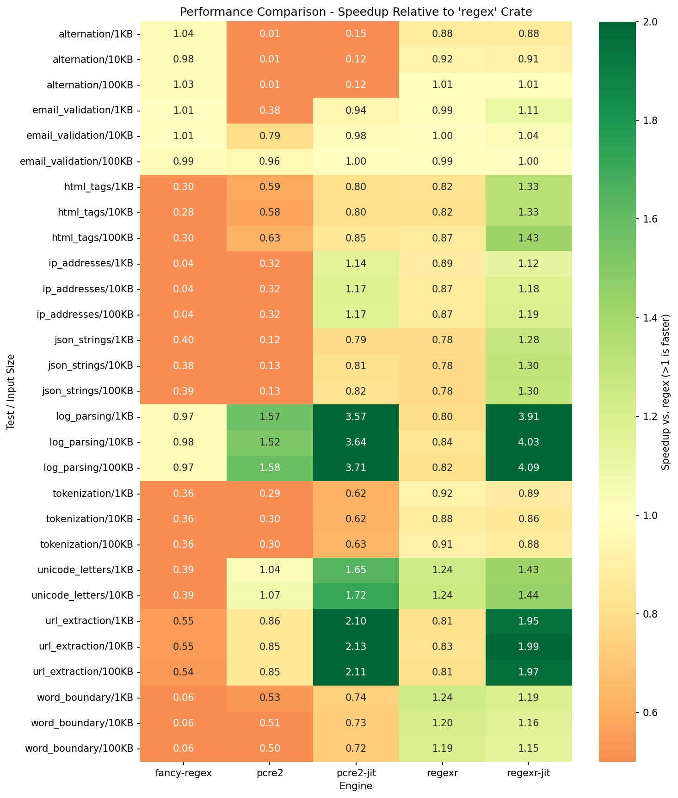

# regexr

**A specialized, pure-Rust regex engine designed for LLM tokenization and complex pattern matching.**

[](https://crates.io/crates/regexr)
[](https://docs.rs/regexr)
[](LICENSE)

---

> Originally created as the regex backend for [**splintr**](https://github.com/ml-rust/splintr), an LLM tokenizer. Passes compliance tests for industry-standard tokenizer patterns (OpenAI's `cl100k_base`, Meta's Llama 3).
>
> Please report issues on the [Issue Tracker](https://github.com/ml-rust/regexr/issues).

---

## 🎯 When to use `regexr`

**This is a specialized tool, not a general-purpose replacement.**

The Rust ecosystem already has the excellent, battle-tested [**`regex`**](https://crates.io/crates/regex) crate. For 99% of use cases, you should use that.

**Only use `regexr` if you specifically need:**

1.  **Lookarounds:** You need features like `(?=...)`, `(?<=...)`, or `(?!\S)` without C dependencies.
    - _Why not `regex`?_ It intentionally omits lookarounds to guarantee linear time.
    - _Why not `pcre2`?_ Requires C library and FFI.
2.  **JIT Compilation in Pure Rust:** You want native code generation for hot patterns without C dependencies.
    - _Why not `regex`/`fancy-regex`?_ Neither offers JIT compilation.
    - _Why not `pcre2`?_ Requires C library and FFI.
3.  **Pure Rust Dependency:** You need advanced features (Lookarounds, Backreferences) but cannot use `pcre2` due to unsafe C bindings or build complexity.
4.  **Bounded Execution:** You want ReDoS protection that **memoizes** states (guaranteeing completion) rather than just **aborting** after a timeout (like `pcre2`).

## The Problem Solved

Developers building LLM tokenizers (like GPT-4 or Llama 3) currently face a dilemma in Rust:

- **`regex` crate:** Fast, safe, but **lacks lookarounds** and **JIT compilation**.
- **`fancy-regex`:** Supports lookarounds, but **lacks JIT compilation**.
- **`pcre2`:** Supports everything including JIT, but introduces **unsafe C bindings** and external dependencies.

**`regexr` bridges this gap.** It provides **Lookarounds + JIT compilation + Backreferences** while remaining **100% Pure Rust**.

## Installation

Add this to your `Cargo.toml`:

```toml
[dependencies]
regexr = "0.x"
```

For JIT compilation support:

```toml
[dependencies]
regexr = { version = "0.x", features = ["full"] }
```

## Usage

### Basic matching

```rust
use regexr::Regex;

let re = Regex::new(r"\w+").unwrap();
assert!(re.is_match("hello"));

// Find first match
if let Some(m) = re.find("hello world") {
    println!("Found: {}", m.as_str()); // "hello"
}

// Find all matches
for m in re.find_iter("hello world") {
    println!("{}", m.as_str());
}
```

### Capture groups

```rust
use regexr::Regex;

let re = Regex::new(r"(\w+)@(\w+)\.(\w+)").unwrap();
let caps = re.captures("user@example.com").unwrap();

println!("{}", &caps[0]); // "user@example.com"
println!("{}", &caps[1]); // "user"
println!("{}", &caps[2]); // "example"
println!("{}", &caps[3]); // "com"
```

### Named captures

```rust
use regexr::Regex;

let re = Regex::new(r"(?P<user>\w+)@(?P<domain>\w+\.\w+)").unwrap();
let caps = re.captures("user@example.com").unwrap();

println!("{}", &caps["user"]);   // "user"
println!("{}", &caps["domain"]); // "example.com"
```

### JIT compilation

Enable JIT for patterns that will be matched many times:

```rust
use regexr::RegexBuilder;

let re = RegexBuilder::new(r"\w+")
    .jit(true)
    .build()
    .unwrap();

assert!(re.is_match("hello"));
```

### Prefix optimization for tokenizers

For patterns with many literal alternatives (e.g., keyword matching in tokenizers):

```rust
use regexr::RegexBuilder;

let re = RegexBuilder::new(r"(function|for|while|if|else|return)")
    .optimize_prefixes(true)
    .build()
    .unwrap();

assert!(re.is_match("function"));
```

### Text replacement

```rust
use regexr::Regex;

let re = Regex::new(r"\d+").unwrap();

// Replace first match
let result = re.replace("abc 123 def", "NUM");
assert_eq!(result, "abc NUM def");

// Replace all matches
let result = re.replace_all("abc 123 def 456", "NUM");
assert_eq!(result, "abc NUM def NUM");
```

## Feature Flags

- `simd` (default): Enables SIMD-accelerated literal search
- `jit`: Enables JIT compilation (x86-64 and ARM64)
- `full`: Enables both JIT and SIMD

### Platform Support

| Platform                    | JIT Support | SIMD Support |
| --------------------------- | ----------- | ------------ |
| Linux x86-64                | ✓           | ✓ (AVX2)     |
| Linux ARM64                 | ✓           | ✗            |
| macOS x86-64                | ✓           | ✓ (AVX2)     |
| macOS ARM64 (Apple Silicon) | ✓           | ✗            |
| Windows x86-64              | ✓           | ✓ (AVX2)     |
| WASM (wasm32)               | ✗           | ✗            |
| Other                       | ✗           | ✗            |

Build without default features for a minimal installation (also works for WASM):

```bash
cargo build --no-default-features                           # Minimal (PikeVM + LazyDFA only)
cargo build --no-default-features --target wasm32-unknown-unknown  # WASM target
```

Build with all optimizations:

```bash
cargo build --features "full"
```

## Engine Selection

The library automatically selects the best execution engine based on pattern characteristics:

**Non-JIT mode** (default):

- **ShiftOr**: Small patterns (≤64 states) without anchors/word boundaries
- **EagerDfa**: Patterns with word boundaries or anchors
- **LazyDfa**: General patterns with on-demand state construction
- **BacktrackingVm**: Patterns with backreferences
- **PikeVm**: Patterns with lookaround or non-greedy quantifiers

**JIT mode** (with `jit` feature):

- **BacktrackingJit**: Patterns with backreferences
- **TaggedNfa**: Patterns with lookaround or non-greedy quantifiers
- **JitShiftOr**: Small patterns with alternations
- **DFA JIT**: General patterns, benefits from SIMD prefiltering

See [docs/architecture.md](docs/architecture.md) for details on the engine selection logic.

## Performance

Speedup relative to `regex` crate (higher is better):



**Highlights** (speedup vs `regex` crate):

| Benchmark        | `regexr`       | `regexr-jit`   | `pcre2-jit` |
| ---------------- | -------------- | -------------- | ----------- |
| log_parsing      | 0.80-0.84x     | **3.91-4.09x** | 3.57-3.71x  |
| url_extraction   | 0.81-0.83x     | **1.95-1.99x** | 2.10-2.13x  |
| unicode_letters  | **1.24x**      | **1.43-1.44x** | 1.65-1.72x  |
| html_tags        | 0.82-0.87x     | **1.33-1.43x** | 0.80-0.85x  |
| word_boundary    | **1.19-1.24x** | **1.15-1.19x** | 0.72-0.74x  |
| email_validation | 0.99-1.00x     | 1.00-1.11x     | 0.94-1.00x  |
| alternation      | 0.88-1.01x     | 0.88-1.01x     | 0.12-0.15x  |

- **`regexr-jit`** excels at log parsing (4x faster than `regex`)
- **`regexr`** (non-JIT) matches `regex` performance on most patterns
- Both outperform `fancy-regex` and `pcre2` (non-JIT) consistently

## Documentation

- [Architecture Overview](docs/architecture.md) - Engine architecture and selection logic
- [Features](docs/features.md) - Detailed feature documentation

## Citation

If you use `regexr` in your research, please cite:

```bibtex
@software{regexr2025,
  author       = {Syah, Farhan},
  title        = {regexr: A Pure-Rust Regex Engine with JIT Compilation for LLM Tokenization},
  year         = {2025},
  url          = {https://github.com/ml-rust/regexr},
  note         = {Pure-Rust regex engine with lookaround support and JIT compilation}
}
```
